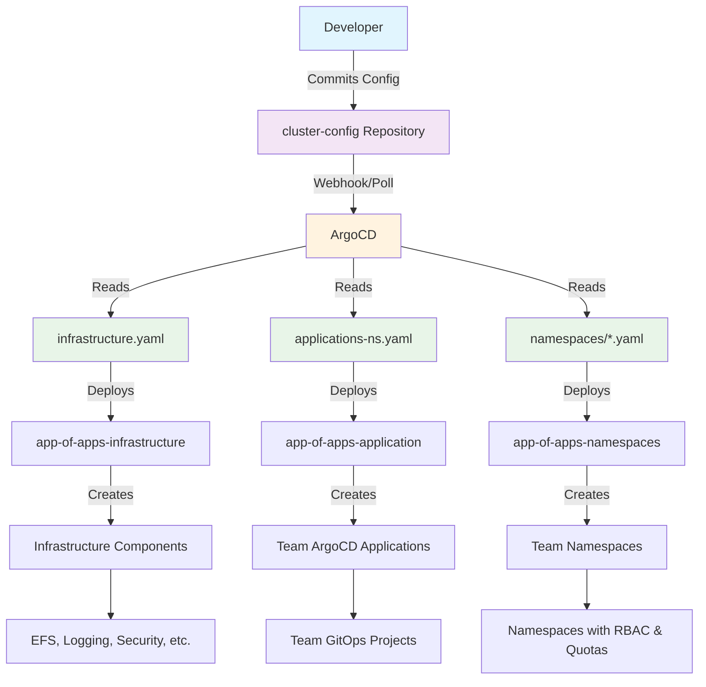

# ROSA HCP Dedicated VPC - Cluster Configuration

This repository contains the GitOps configuration definitions for OpenShift clusters deployed using the ROSA (Red Hat OpenShift Service on AWS) HCP (Hosted Control Plane) architecture with dedicated VPC configurations. It serves as the single source of truth for cluster infrastructure, application namespaces, and team-specific configurations across multiple environments.

## What is This Repository?

The `cluster-config` repository is the **configuration layer** of the GitOps architecture, containing declarative YAML files that define:

- **Infrastructure Components**: Platform services like storage, logging, security, and management tools
- **Application Namespaces**: Team-specific namespace configurations with resource quotas and RBAC
- **Environment Separation**: Different configurations for each cluster environment
- **Team Boundaries**: Isolated configuration files for different teams and applications

This repository works in conjunction with the [helm-repository](https://github.com/rosa-hcp-dedicated-vpc/helm-repository) to provide a complete GitOps solution.

## Why This Architecture?

### 🎯 **Separation of Concerns**
- **helm-repository**: Contains reusable Helm charts (the "how")
- **cluster-config**: Contains environment-specific values (the "what")
- **Terraform**: Provisions infrastructure and bootstraps GitOps (the "foundation")

### 🔄 **GitOps Principles**
- **Declarative**: All configurations are declared in YAML files
- **Versioned**: Git provides complete audit trail and rollback capabilities
- **Automated**: ArgoCD continuously reconciles desired state
- **Secure**: Git-based access control and approval workflows

### 🏢 **Multi-Tenancy**
- **Environment Isolation**: Separate configurations per cluster
- **Team Isolation**: Individual namespace configuration files per team
- **RBAC Integration**: Active Directory group-based access control
- **Resource Governance**: Quotas and policies enforced per team

## Repository Structure

```
cluster-config/
├── README.md                    # This file
└── nonprod/                     # Non-production environments
    ├── np-hub/                  # Hub cluster (ACM + shared services)
    │   ├── infrastructure.yaml  # Infrastructure components
    │   ├── applications-ns.yaml # Team application definitions
    │   └── namespaces/          # Team namespace configurations
    │       ├── accounting-abcd.yaml
    │       └── payments-1234.yaml
    ├── np-app-1/               # Application workload cluster
    │   ├── infrastructure.yaml
    │   ├── applications-ns.yaml
    │   └── namespaces/
    │       ├── accounting-abcd.yaml
    │       └── payments-1234.yaml
    ├── np-os-ai/               # AI/ML workload cluster
    │   ├── infrastructure.yaml
    │   ├── applications-ns.yaml
    │   └── namespaces/
    │       ├── accounting-abcd.yaml
    │       └── payments-1234.yaml
    └── np-os-virt/             # Virtualization workload cluster
        ├── infrastructure.yaml
        ├── applications-ns.yaml
        └── namespaces/
            ├── accounting-abcd.yaml
            └── payments-1234.yaml
```

## How It Works

### 🚀 **GitOps Flow**



### 📋 **Configuration Layers**

#### 1. **Infrastructure Layer** (`infrastructure.yaml`)
Defines platform-level components deployed to the cluster:

```yaml
# Example: nonprod/np-hub/infrastructure.yaml
teamName: cluster-config
defaults:
  helmRepoUrl: https://rosa-hcp-dedicated-vpc.github.io/helm-repository/
  plugin: true  # Enable AWS Secrets Manager integration
  AWS_REGION: "ap-southeast-2"

infrastructure:
  - chart: cluster-efs
    targetRevision: 0.3.0
    namespace: openshift-cluster-csi-drivers
    values:
      roleArn: arn:aws:iam::808082629126:role/np-hub-rosa-efs-csi-role-iam
      fileSystemId: fs-0718beb50be783f1e
  
  - chart: cluster-logging
    targetRevision: 0.4.0
    namespace: openshift-logging
    values:
      roleArn: arn:aws:iam::808082629126:role/np-hub-rosa-cloudwatch-role-iam
      region: ap-southeast-2
```

#### 2. **Application Layer** (`applications-ns.yaml`)
Defines team applications and their namespace configurations:

```yaml
# Example: nonprod/np-hub/applications-ns.yaml
teamName: platform
defaults:
  chart: app-of-apps-namespaces
  targetRevision: 0.3.2

applications:
  - name: payments
    apmnum: "1234"
    appserviceNumber: "5678"
    gitopsCreate: true  # Create team ArgoCD project
    gitRepoUrl: 'https://github.com/rosa-hcp-dedicated-vpc/cluster-config.git'
    gitPath: nonprod/np-hub/namespaces/payments-1234.yaml
    appProject:
      adGroup: PFAUTHAD  # Active Directory group
      repos:
      - 'https://rosa-hcp-dedicated-vpc.github.io/helm-repository'
      - 'https://github.com/rosa-hcp-dedicated-vpc/cluster-config.git'
```

#### 3. **Namespace Layer** (`namespaces/*.yaml`)
Defines individual team namespace configurations:

```yaml
# Example: nonprod/np-hub/namespaces/accounting-abcd.yaml
apmnum: "abcd"
defaults:
  chart: namespaces
  targetRevision: 1.4.9
  ecrUpdateRole: arn:aws:iam:::role/rosa-ecr-access-role
  primary-owner: pafoster@redhat.com
  zone: test
  
  # Project-level settings
  annotations:
    comments: "accounting teams namespaces dev only"
    description: "accounting namespaces"
  labels:
    domain: "Infrastructure_and_Cloud"
    quota: "resourcequota"
  groupname:
    admin_group: pa_admins

# Individual namespaces for the team
namespaces:
- name: accounting-ns-dev
  labels:
    dynatrace: true
  resourceQuota:
    limits_cpu: "250m"
    limits_memory: "1Gi"
    requests_cpu: "200m"
    requests_memory: "500Mi"
    persistentvolumeclaims: "5"
    pods: "50"
    
- name: accounting-ns-test
  # Similar configuration for test environment
```

## Environment-Specific Configurations

### 🏢 **Cluster Types**

| Environment | Purpose | Special Features |
|-------------|---------|------------------|
| **np-hub** | Hub cluster | ACM, shared services, management tools |
| **np-app-1** | Application workloads | Standard application hosting |
| **np-os-ai** | AI/ML workloads | RHODS (OpenShift Data Science) |
| **np-os-virt** | Virtualization | OpenShift Virtualization capabilities |

### 🔧 **Environment Differences**

Each environment can have different:
- **Infrastructure components**: Different operators or versions
- **Resource quotas**: Varying limits based on cluster capacity
- **Security policies**: Environment-specific compliance requirements
- **AWS integrations**: Different IAM roles and resources per environment

Example differences:
```yaml
# np-hub/infrastructure.yaml (includes ACM)
infrastructure:
  - chart: acm-operator
    targetRevision: 0.1.3

# np-os-ai/infrastructure.yaml (includes RHODS)
infrastructure:
  - chart: rhods-operator
    targetRevision: 1.0.3
```

## Team Onboarding Process

### 🆕 **Adding a New Team**

1. **Create Team Namespace Configuration**:
   ```bash
   # Create namespace config file
   cp nonprod/np-hub/namespaces/accounting-abcd.yaml \
      nonprod/np-hub/namespaces/newteam-wxyz.yaml
   
   # Update team-specific values
   vim nonprod/np-hub/namespaces/newteam-wxyz.yaml
   ```

2. **Register Team in Applications**:
   ```yaml
   # Add to nonprod/np-hub/applications-ns.yaml
   applications:
     - name: newteam
       apmnum: "wxyz"
       appserviceNumber: "9999"
       gitopsCreate: true
       gitPath: nonprod/np-hub/namespaces/newteam-wxyz.yaml
       appProject:
         adGroup: NEWTEAMAD
   ```

3. **Replicate Across Environments**:
   ```bash
   # Copy to other environments as needed
   cp nonprod/np-hub/namespaces/newteam-wxyz.yaml nonprod/np-app-1/namespaces/
   # Update applications-ns.yaml in each environment
   ```

4. **Commit and Deploy**:
   ```bash
   git add .
   git commit -m "Add newteam namespace configuration"
   git push origin main
   ```

### 🔄 **GitOps Automation**
Once committed, ArgoCD automatically:
1. Detects the configuration changes
2. Creates the team's ArgoCD Application
3. Deploys the namespace configuration
4. Sets up RBAC and resource quotas
5. Creates team ArgoCD project (if `gitopsCreate: true`)

## Configuration Management

### 📝 **Making Changes**

#### **Infrastructure Changes**
```bash
# Update infrastructure component version
vim nonprod/np-hub/infrastructure.yaml

# Example: Update EFS chart version
infrastructure:
  - chart: cluster-efs
    targetRevision: 0.3.1  # ← Bump version
```

#### **Team Configuration Changes**
```bash
# Update team namespace configuration
vim nonprod/np-hub/namespaces/accounting-abcd.yaml

# Example: Increase resource quota
resourceQuota:
  limits_cpu: "500m"      # ← Increased from 250m
  limits_memory: "2Gi"    # ← Increased from 1Gi
```

#### **Adding New Environments**
```bash
# Create new environment directory
mkdir -p nonprod/np-new-env/namespaces

# Copy base configurations
cp nonprod/np-hub/*.yaml nonprod/np-new-env/
cp nonprod/np-hub/namespaces/*.yaml nonprod/np-new-env/namespaces/

# Customize for new environment
vim nonprod/np-new-env/infrastructure.yaml
```

## Adding a New Cluster

### 🆕 **New Cluster Onboarding Process**

When adding a new OpenShift cluster to the GitOps management system, follow this comprehensive process:

#### **1. Infrastructure Prerequisites**
Before adding cluster configuration, ensure the cluster is provisioned via Terraform:

```bash
# 1. Add cluster definition to Terraform
# Edit: rosa-hcp-dedicated-vpc/terraform/clusters/<new-cluster>.json
{
  "cluster_name": "np-new-cluster",
  "aws_region": "ap-southeast-2",
  "aws_account_id": "808082629126",
  "vpc_id": "vpc-xxxxxxxxx",
  "subnet_ids": ["subnet-xxxxxxxx", "subnet-yyyyyyyy"],
  "machine_type": "m5.xlarge",
  "replicas": 3
}

# 2. Deploy infrastructure via Terraform
cd rosa-hcp-dedicated-vpc/terraform
terraform plan -target=module.rosa_cluster["np-new-cluster"]
terraform apply -target=module.rosa_cluster["np-new-cluster"]
```

#### **2. Create Cluster Configuration Structure**
```bash
# Navigate to cluster-config repository
cd cluster-config

# Create new cluster directory structure
mkdir -p nonprod/np-new-cluster/namespaces

# Copy base configuration from similar cluster type
# For standard app cluster:
cp nonprod/np-app-1/*.yaml nonprod/np-new-cluster/
cp -r nonprod/np-app-1/namespaces/* nonprod/np-new-cluster/namespaces/

# For specialized clusters, copy from appropriate base:
# Hub cluster: cp nonprod/np-hub/*.yaml
# AI/ML cluster: cp nonprod/np-os-ai/*.yaml  
# Virtualization: cp nonprod/np-os-virt/*.yaml
```

#### **3. Customize Infrastructure Configuration**
```bash
# Edit infrastructure configuration for new cluster
vim nonprod/np-new-cluster/infrastructure.yaml
```

Update cluster-specific values:
```yaml
# nonprod/np-new-cluster/infrastructure.yaml
teamName: cluster-config
defaults:
  helmRepoUrl: https://rosa-hcp-dedicated-vpc.github.io/helm-repository/
  plugin: true
  AWS_REGION: "ap-southeast-2"  # ← Update for cluster region
  AVP_TYPE: "awssecretsmanager"

infrastructure:
  - chart: cluster-efs
    targetRevision: 0.3.0
    namespace: openshift-cluster-csi-drivers
    values:
      # ← Update with new cluster's IAM role and EFS ID
      roleArn: arn:aws:iam::808082629126:role/np-new-cluster-rosa-efs-csi-role-iam
      fileSystemId: fs-0xxxxxxxxxxxxxxxxx
      helper-operator:
        startingCSV: aws-efs-csi-driver-operator.v4.19.0-202506020913

  - chart: cluster-logging
    targetRevision: 0.4.0
    namespace: openshift-logging
    values:
      # ← Update with new cluster's CloudWatch role
      roleArn: arn:aws:iam::808082629126:role/np-new-cluster-rosa-cloudwatch-role-iam
      region: ap-southeast-2
      helper-operator:
        startingCSV: cluster-logging.v6.2.3

  # Add cluster-specific components as needed
  # For AI/ML clusters, add:
  # - chart: rhods-operator
  #   targetRevision: 1.0.3
  
  # For hub clusters, add:
  # - chart: acm-operator
  #   targetRevision: 0.1.3
```

#### **4. Configure Team Applications**
```bash
# Edit applications configuration
vim nonprod/np-new-cluster/applications-ns.yaml
```

Update team configurations:
```yaml
# nonprod/np-new-cluster/applications-ns.yaml
teamName: platform
defaults:
  chart: app-of-apps-namespaces
  targetRevision: 0.3.2
  helmRepoUrl: https://rosa-hcp-dedicated-vpc.github.io/helm-repository

applications:
  - name: payments
    apmnum: "1234"
    appserviceNumber: "5678"
    gitopsCreate: true
    gitRepoUrl: 'https://github.com/rosa-hcp-dedicated-vpc/cluster-config.git'
    # ← Update path to point to new cluster
    gitPath: nonprod/np-new-cluster/namespaces/payments-1234.yaml
    appProject:
      adGroup: PFAUTHAD
      repos:
      - 'https://rosa-hcp-dedicated-vpc.github.io/helm-repository'
      - 'https://github.com/rosa-hcp-dedicated-vpc/cluster-config.git'

  - name: accounting
    apmnum: "abcd"
    appserviceNumber: "efgh"
    gitopsCreate: false
    gitRepoUrl: 'https://github.com/rosa-hcp-dedicated-vpc/cluster-config.git'
    # ← Update path to point to new cluster
    gitPath: nonprod/np-new-cluster/namespaces/accounting-abcd.yaml
    appProject:
      adGroup: PFAUTHAD
      repos:
      - 'https://rosa-hcp-dedicated-vpc.github.io/helm-repository'
      - 'https://github.com/rosa-hcp-dedicated-vpc/cluster-config.git'
```

#### **5. Update Team Namespace Configurations**
```bash
# Update each team's namespace configuration
vim nonprod/np-new-cluster/namespaces/accounting-abcd.yaml
vim nonprod/np-new-cluster/namespaces/payments-1234.yaml
```

Update cluster-specific values:
```yaml
# nonprod/np-new-cluster/namespaces/accounting-abcd.yaml
apmnum: "abcd"
defaults:
  chart: namespaces
  targetRevision: 1.4.9
  # ← Update with new cluster's ECR role
  ecrUpdateRole: arn:aws:iam::808082629126:role/np-new-cluster-rosa-ecr-access-role
  primary-owner: pafoster@redhat.com
  zone: test  # ← Update zone if different (test/prod/staging)
  
  annotations:
    comments: "accounting teams namespaces for np-new-cluster"
    description: "accounting namespaces"
    display_name: "accounting template"
  
  labels:
    domain: "Infrastructure_and_Cloud"
    primary-owner: pafoster@redhat.com
    quota: "resourcequota"
    region: "NoNodeSelector"
    # ← Update cluster-specific labels if needed

# Namespace definitions remain the same unless cluster has different capacity
namespaces:
- name: accounting-ns-dev
  labels:
    dynatrace: true
  resourceQuota:
    limits_cpu: "250m"      # ← Adjust based on cluster capacity
    limits_memory: "1Gi"    # ← Adjust based on cluster capacity
    requests_cpu: "200m"
    requests_memory: "500Mi"
    persistentvolumeclaims: "5"
    limits_ephemeral_storage: "4Gi"
    pods: "50"
```

#### **6. Bootstrap GitOps on New Cluster**

The cluster can be bootstrapped through two methods:

##### **Method 1: Direct Terraform Bootstrap (Standard)**
```bash
# The cluster bootstrap is handled by Terraform during cluster creation
# Uses cluster-bootstrap chart deployed via Helm commands in bootstrap.tftpl

# Verify bootstrap completed successfully:
# Check cluster status
rosa describe cluster np-new-cluster

# Verify OpenShift GitOps is installed
oc get pods -n openshift-gitops-operator
oc get pods -n openshift-gitops

# Check ArgoCD applications are created
oc get applications -n openshift-gitops
```

##### **Method 2: ACM (Advanced Cluster Management) Bootstrap**
```bash
# For clusters managed through ACM hub cluster
# Bootstrap is handled via cluster-bootstrap-acm-spoke chart

# 1. Import cluster into ACM hub
oc apply -f - <<EOF
apiVersion: cluster.open-cluster-management.io/v1
kind: ManagedCluster
metadata:
  name: np-new-cluster
  labels:
    cluster.open-cluster-management.io/clusterset: default
spec:
  hubAcceptsClient: true
EOF

# 2. Apply klusterlet addon for GitOps bootstrap
oc apply -f - <<EOF
apiVersion: agent.open-cluster-management.io/v1
kind: KlusterletAddonConfig
metadata:
  name: np-new-cluster
  namespace: np-new-cluster
spec:
  clusterName: np-new-cluster
  clusterNamespace: np-new-cluster
  applicationManager:
    enabled: true
  policyController:
    enabled: true
  searchCollector:
    enabled: true
  certPolicyController:
    enabled: true
EOF

# 3. Verify cluster import and bootstrap
oc get managedclusters
oc get klusterletaddonconfig -n np-new-cluster
```

**Bootstrap Method Selection**:
- **Direct Terraform**: Use for standalone clusters or initial hub cluster setup
- **ACM Bootstrap**: Use for spoke clusters managed by an existing ACM hub cluster

Both methods deploy the same GitOps configuration but through different orchestration paths:
- **Terraform**: Executes `helm install cluster-bootstrap` directly on target cluster
- **ACM**: Deploys `cluster-bootstrap-acm-spoke` chart via ACM policies to spoke cluster

#### **7. Commit and Deploy Configuration**
```bash
# Add all new configuration files
git add nonprod/np-new-cluster/

# Commit with descriptive message
git commit -m "Add configuration for new cluster: np-new-cluster

- Infrastructure: EFS, logging, compliance components
- Applications: payments and accounting team configurations  
- Namespaces: dev and test environments for each team
- AWS integration: cluster-specific IAM roles and resources"

# Push to trigger GitOps deployment
git push origin main
```

#### **8. Verify Deployment**
```bash
# Connect to new cluster
oc login --server=https://api.np-new-cluster.example.com:6443

# Check ArgoCD applications
oc get applications -n openshift-gitops

# Verify infrastructure components
oc get csv -A | grep -E "(efs|logging|compliance)"

# Check team namespaces
oc get namespaces | grep -E "(accounting|payments)"

# Verify resource quotas
oc get resourcequota -n accounting-ns-dev
oc get resourcequota -n payments-ns-dev

# Check RBAC
oc get rolebindings -n accounting-ns-dev
```

### 🔧 **Cluster-Specific Considerations**

#### **Hub Clusters**
For clusters that will host Advanced Cluster Management:
```yaml
# Add to infrastructure.yaml
infrastructure:
  - chart: acm-operator
    targetRevision: 0.1.3
    namespace: open-cluster-management
    values:
      helper-operator:
        startingCSV: acm-operator.v2.13.3
```

#### **AI/ML Clusters**  
For clusters that will host OpenShift Data Science:
```yaml
# Add to infrastructure.yaml
infrastructure:
  - chart: rhods-operator
    targetRevision: 1.0.3
    namespace: redhat-ods-operator
    values:
      helper-operator:
        startingCSV: rhods-operator.v2.15.0
```

#### **Virtualization Clusters**
For clusters with OpenShift Virtualization capabilities:
```yaml
# Add specialized storage and networking components
infrastructure:
  - chart: cluster-storage-virtualization
    targetRevision: 1.0.0
    namespace: openshift-cnv
```

### 🚨 **Common Issues During Cluster Addition**

#### **Bootstrap Failures**
```bash
# Check Terraform bootstrap logs
terraform show -json | jq '.values.root_module.resources[] | select(.type=="shell_script")'

# Verify cluster-bootstrap chart deployment
oc get pods -n openshift-gitops-operator
oc logs -n openshift-gitops-operator deployment/gitops-operator-controller-manager
```

#### **ArgoCD Application Sync Issues**
```bash
# Check application status
oc get applications -n openshift-gitops -o wide

# View application details
oc describe application cluster-config-cluster-config -n openshift-gitops

# Force sync if needed
argocd app sync cluster-config-cluster-config --force
```

#### **AWS IAM Role Issues**
```bash
# Verify IAM roles exist in AWS
aws iam get-role --role-name np-new-cluster-rosa-efs-csi-role-iam
aws iam get-role --role-name np-new-cluster-rosa-cloudwatch-role-iam

# Check OIDC provider trust relationships
aws iam list-role-policies --role-name np-new-cluster-rosa-efs-csi-role-iam
```

### 📋 **New Cluster Checklist**

- [ ] Cluster provisioned via Terraform
- [ ] Bootstrap completed successfully  
- [ ] Configuration directory created
- [ ] Infrastructure configuration customized
- [ ] Team applications configured
- [ ] Namespace configurations updated
- [ ] AWS IAM roles and resources updated
- [ ] Configuration committed and pushed
- [ ] ArgoCD applications syncing successfully
- [ ] Infrastructure components deployed
- [ ] Team namespaces created
- [ ] RBAC and resource quotas applied
- [ ] Monitoring and logging configured
- [ ] Team access verified

### 🔍 **Validation & Testing**

#### **Local Validation**
```bash
# Validate YAML syntax
yamllint nonprod/np-hub/infrastructure.yaml

# Test Helm templating with actual values
helm template test-infra \
  https://rosa-hcp-dedicated-vpc.github.io/helm-repository/charts/app-of-apps-infrastructure-0.1.2.tgz \
  -f nonprod/np-hub/infrastructure.yaml
```

#### **ArgoCD Validation**
```bash
# Check application status
oc get applications -n openshift-gitops

# View application details
oc describe application cluster-efs-cluster-config -n openshift-gitops

# Check sync status
argocd app list
argocd app sync <application-name>
```

## Security & Access Control

### 🔐 **RBAC Integration**

#### **Active Directory Groups**
```yaml
# Team-specific AD group access
appProject:
  adGroup: PFAUTHAD        # Maps to AD group
  repos:                   # Restricted repository access
  - 'https://rosa-hcp-dedicated-vpc.github.io/helm-repository'
  - 'https://github.com/rosa-hcp-dedicated-vpc/cluster-config.git'
```

#### **Namespace-Level RBAC**
```yaml
# Namespace admin group
groupname:
  admin_group: pa_admins   # AD group with admin access to namespaces
```

### 🛡️ **Security Boundaries**

1. **Repository Level**: Git-based access control
2. **ArgoCD Level**: Project-based application access
3. **Namespace Level**: Kubernetes RBAC with AD integration
4. **Resource Level**: Resource quotas and network policies

### 🔑 **AWS Integration**
```yaml
# Environment-specific IAM roles
values:
  roleArn: arn:aws:iam::808082629126:role/np-hub-rosa-efs-csi-role-iam
  
# Secrets Manager integration
defaults:
  plugin: true
  AVP_TYPE: "awssecretsmanager"
  AWS_REGION: "ap-southeast-2"
```

## Troubleshooting

### 🔧 **Common Issues**

#### **Application Not Syncing**
```bash
# Check application status
oc get application <app-name> -n openshift-gitops -o yaml

# Common causes:
# 1. Invalid YAML syntax
# 2. Incorrect chart version
# 3. Missing required values
# 4. Repository access issues
```

#### **Namespace Not Created**
```bash
# Check namespace application
oc get applications -n openshift-gitops | grep <team-name>

# Verify namespace configuration
helm template test ./charts/namespaces \
  -f cluster-config/nonprod/np-hub/namespaces/<team-file>.yaml
```

#### **RBAC Issues**
```bash
# Check AppProject configuration
oc get appproject <team-name>-project -n openshift-gitops -o yaml

# Verify AD group mapping
oc get rolebindings -n <namespace> | grep <team-name>
```

### 📊 **Monitoring & Observability**

#### **ArgoCD Dashboard**
- Access via OpenShift Console → ArgoCD link
- Monitor application sync status
- View deployment history and rollbacks

#### **Configuration Drift Detection**
```bash
# Check for configuration drift
argocd app diff <application-name>

# Force sync if needed
argocd app sync <application-name> --force
```

## Best Practices

### ✅ **Configuration Management**

1. **Version Control Everything**: All configurations in Git
2. **Environment Parity**: Consistent structure across environments
3. **Incremental Changes**: Small, focused commits
4. **Descriptive Commits**: Clear commit messages explaining changes
5. **Review Process**: Pull request reviews for all changes

### 🏗️ **Team Configurations**

1. **Consistent Naming**: Use `<team>-<apmnum>` pattern
2. **Resource Quotas**: Always define appropriate limits
3. **RBAC Setup**: Configure AD groups for each team
4. **Documentation**: Comment complex configurations
5. **Environment Specific**: Tailor configurations per environment

### 🔄 **GitOps Workflow**

1. **Single Source of Truth**: This repository is authoritative
2. **Automated Deployment**: Let ArgoCD handle deployments
3. **Monitoring**: Watch for sync failures and drift
4. **Rollback Ready**: Use Git history for quick rollbacks
5. **Testing**: Validate changes in non-production first

## Contributing

### 📋 **Change Process**

1. **Create Branch**: `git checkout -b feature/add-newteam-config`
2. **Make Changes**: Update configuration files
3. **Test Locally**: Validate YAML and test Helm templating
4. **Commit Changes**: Descriptive commit messages
5. **Create PR**: Submit for review
6. **Deploy**: Merge triggers automatic deployment

### 🧪 **Testing Changes**

```bash
# Validate YAML syntax
find . -name "*.yaml" -exec yamllint {} \;

# Test Helm templating
helm template test-config \
  https://rosa-hcp-dedicated-vpc.github.io/helm-repository/charts/app-of-apps-infrastructure-0.1.2.tgz \
  -f nonprod/np-hub/infrastructure.yaml

# Dry-run ArgoCD sync
argocd app sync <app-name> --dry-run
```

## Related Repositories

- **[helm-repository](https://github.com/rosa-hcp-dedicated-vpc/helm-repository)**: Helm charts and templates
- **[rosa-hcp-dedicated-vpc](https://github.com/rosa-hcp-dedicated-vpc/rosa-hcp-dedicated-vpc)**: Terraform infrastructure code

## Support

For questions or issues:
1. Check existing configurations for examples
2. Review ArgoCD application status and logs
3. Validate YAML syntax and Helm templating
4. Consult individual chart READMEs in helm-repository
5. Create issues in the appropriate repository

This repository is the foundation of the GitOps-driven cluster management system, providing declarative configuration management for OpenShift clusters at scale.
